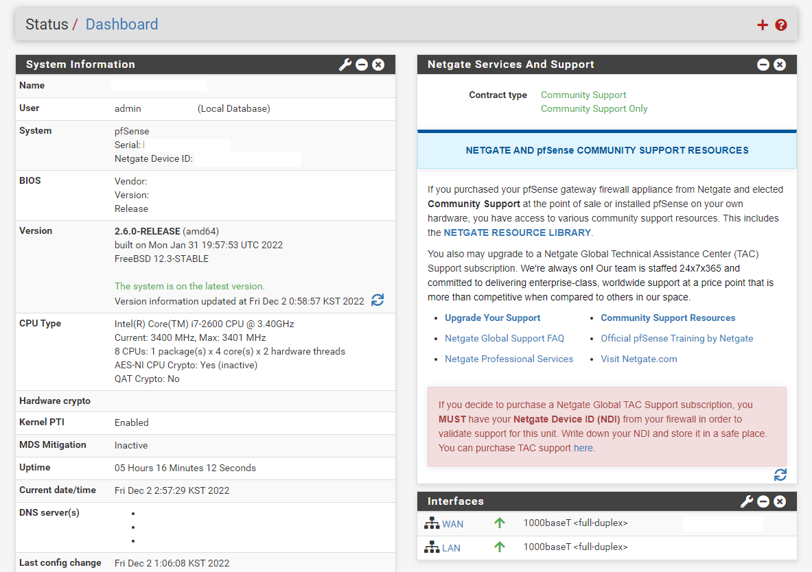

# Install pfSense

## What is pfSense?

- 방화벽 및 라우터 기능을 가진 FreeBSD 배포판
- 오픈 소스 (Community Edition)

## pfSense 설치하기

- USB 메모리에 [pfSense 설치 이미지](https://www.pfsense.org/download/)를 기록
- 설치 과정에서 키맵, 파티션 설정 등만 입력해주면 간단하게 설치 완료 (잘 모르겠으면 Auto (UEFI), Entire Partition 등의 옵션으로 진행할 것)

## pfSense 구성하기

- 설치 완료 후 최초 부팅 시 pfSense에서 아래와 같은 기본 설정을 진행
1. VLAN 설정 여부 - 사용하지 않을 예정이므로 설정하지 않았음
2. WAN, LAN 인터페이스가 어떤 것인지 - 랜 케이블을 탈착하면 터미널에 인터페이스 up/down 여부 표시되므로 보면서 입력
3. WAN 측 DHCP 서버 사용 여부 - 사용 여부에 따라 입력
4. LAN 측 IP / 서브넷 마스크 및 DHCP 서버 사용 여부 - 사용 여부에 따라 입력
5. LAN 측 DHCP 서버 대역 - 사용 여부에 따라 입력

- 큰 문제 없이 진행 된 경우 pfSense를 설정한 LAN 측 IP로 Web에 접속할 수 있음
- Web GUI에 로그인(admin / pfsense)하여 추가 설정 진행
- 대시보드 정상 여부 확인

도움 준 사람 / 링크:

Bell - [GitHub](https://github.com/DragonString), [GitLab](https://gitlab.bellsoft.net/Bell)
